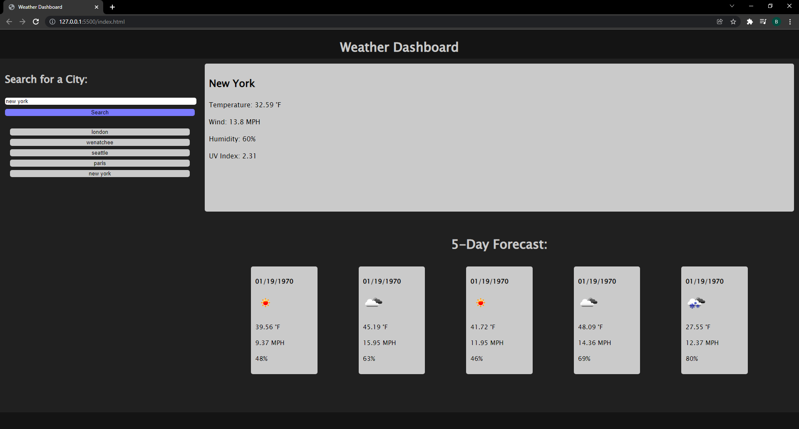

<!-- proj name -->

# Weather Dashboard

<!-- toc -->

## Table of Contents

- [Weather Dashboard](#title)
- [About Weather Dashboard](#about-proj)
- [Getting Started](#getting-started)
- [Usage](#Usage)
- [Testing](#testing)
- [Contributing](#contributing)
- [License](#license)
- [Contact Me](#contact-me)

<!-- about project -->

## About Weather Dashboard

Weather Dashboard is a web application built using Open Weather APIs. with this application you can quickly search for local or foreign weater with the press of a button! 

<!-- Getting Started -->

## Getting Started
This is how you can get started using Weather Dashboard locally. Begin by following these instructions.
### Installation

To install Weather Dashboard simply download or clone the git repository.

<!-- Usage -->

## Usage

To use Weather Dashboard, first begin by following the [install](#getting-started) proccess. From there open the download into a new window and open `index.html` in your browser. If any errors occur please be sure to have your API keys properly linked within `./Assets/js/script.js`. If any other errors occur please contact me using my email.

<!-- Testing -->

## Testing

To test Weather Dashboard follow the [installation](#getting-started) directions, followed by the [usage](#Usage) directions. If any errors are to occur please report them under the issues tab or contact me via email.

<!-- Contributing -->

## Contributing

If you wish to contribute to Weather Dashboard, you can do so by sending any requests or errors to the issues tab, or you can email me.
<!-- Contact Me -->

## Contact Me
- [zortro](https://github.com/zortro)
- ben.r.dominguez@gmail.com

This readme file was generated using [ReadMe Generator](https://github.com/zortro/readme-generator/)